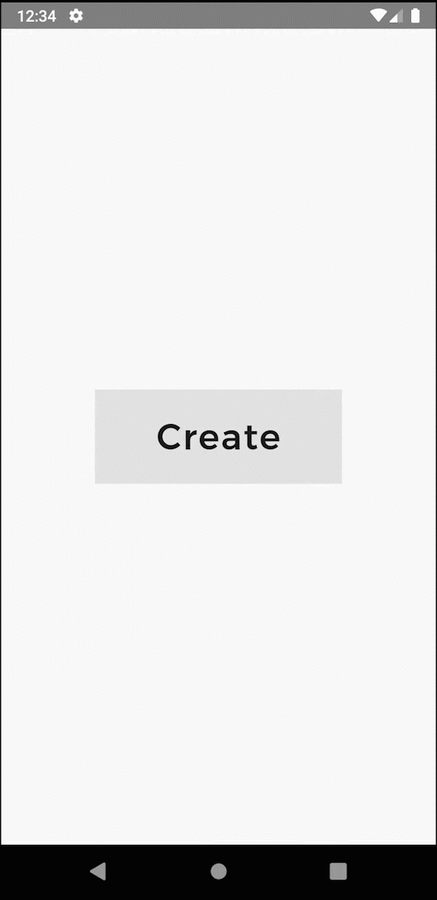

# auttu_test

A new Flutter project as Practice Level for Attu


 

 

### Output



!> you can find some unused files on components, also i've done it with differents  way. you can choose yourself what suit for you. So many provider ha? well, I am just practicing riverpod, hook and freezed.

things can be improve > null check+

<br>

### Dependencies :
````
- flutter_hooks: ^0.17.0
- google_fonts: ^2.1.0
- hooks_riverpod: ^0.14.0+4
- intl: ^0.17.0
````

------

## Getting Started

This project is a starting point for a Flutter application.

A few resources to get you started if this is your first Flutter project:

- [Lab: Write your first Flutter app](https://flutter.dev/docs/get-started/codelab)
- [Cookbook: Useful Flutter samples](https://flutter.dev/docs/cookbook)

For help getting started with Flutter, view our
[online documentation](https://flutter.dev/docs), which offers tutorials,
samples, guidance on mobile development, and a full API reference.
